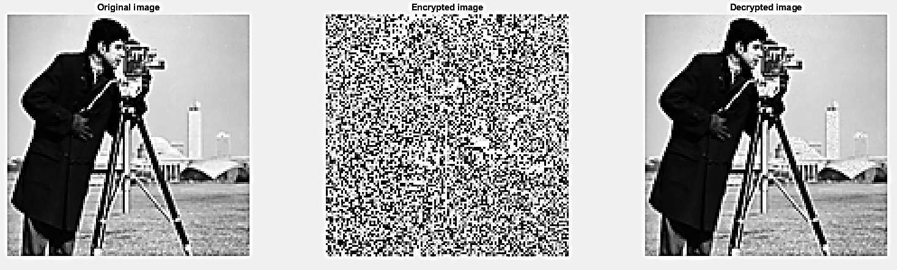

# Implement_RSA_inMatlab

## How does this program work?

1.  Calculate the public and private keys 
2. Program will provide three example images with different pixels density, if user not choose any of the example picture, the program will choose a bench mark image.
3.  Once choose any of image, program will convert image to uint8 array.
4.  Random number will be added to each element of the image array
5.  Program will use the public key to encrypt the image
6.  Program will use the private key to decrypt the image 
7.  The original, encrypted and decrypted image will be display in the output

## When run the program, the parameters and keys are stated in below. 

The p is 17 the q is 19

The x calculated is: 288

The e is: 13

The n calculated is: 323

Public key is: 323 13

The d calculated is: 133

Private key is: 323 133 

## The results of encryption and decryption is stated below.

## The build in three example pictures for tests are stated below
    
    
    

## Requirements and notice for running this code
This code only able to process greyscal images
This code requires:

1: vpi package Variable Precision Integer Arithmetic by John D'Errico
https://uk.mathworks.com/matlabcentral/fileexchange/22725-variable-precision-integer-arithmetic

2: Image processing toolbox

Notice: 
1. The running time may be at least 3 minutes, the parameters choosen above may result 7 minutes running time. 
2. This program is unable to process color pictures but grey level pictures only.
